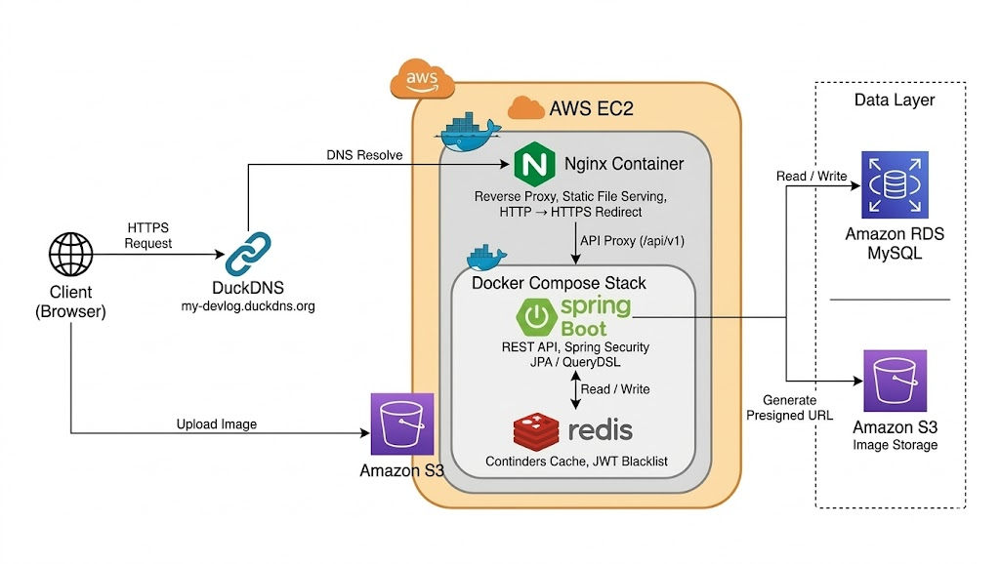

# Blog Platform - Spring Boot 기반 백엔드 블로그 서비스

> 조회수·좋아요 동시성 문제와 실시간 알림 기능을 구현한 백엔드 중심 프로젝트

 

## 핵심 설계 및 문제 해결 기록

### 아키텍처 & 설계
- [Post - Comment간 연관관계 제거 및 Aggregate를 분리한 이유](docs/post-comment-decoupling.md)
- [동적 정렬 구현 방식의 선택과 이유](docs/dynamic-sort-design.md)
- [Post 테이블에 like_count 컬럼을 비정규화 한 이유](docs/post-like-count-denormalization.md)

### 성능 최적화
- [Redis를 활용한 좋아요 카운트 최적화](docs/redis-like-count-optimization.md)
- [검색 API 성능 개선: fetch join을 버리고 @BatchSize를 선택한 이유](docs/search-api-batchsize-optimization.md)
- 

### 동시성 및 이벤트 처리
- [중복 요청을 전제로 설계한 좋아요 기능](docs/like-concurrency-design.md)
- [조회수 이벤트를 비동기로 처리할 때 스레드 풀을 설정한 기준](docs/view-count-event-threadpool.md)
- [SSE 기반 실시간 알림과 트랜잭션 커밋 타이밍 문제 해결](docs/sse-notification-transaction-commit-timing-issue.md)

### 인증 및 보안
- [Refresh Token Rotation과 블랙리스트 전략을 도입한 이유](docs/refresh-token-rotation-blacklist.md)

### 트러블 슈팅
- [Redis 기반 조회수 처리 중 조회수가 사라진 문제 분석](docs/redis-view-count-loss-issue.md)
- [Spring Security 필터 체인에서 예외가 잡히지 않는 문제 해결기](docs/spring-security-filter-exception-handling.md)
- [익명 사용자의 AccessDeniedException이 AccessDeniedHandler로 가지 않는 이유가 뭘까](docs/spring-security-anonymous-access-denied-handler.md)

## 기술 스택

| 영역 | 기술 |
|------|------|
| **Language** | Java 21 |
| **Backend** | Spring Boot 3.5, Spring Security, Spring Data JPA, QueryDSL |
| **Database** | MySQL 8.0, Redis 7.2 |
| **Auth** | JWT, Refresh Token Rotation |
| **Infra** | AWS S3, Docker Compose |
| **Frontend** | Vue.js 3, Pinia, TailwindCSS |
| **Test** | JUnit 5, Testcontainers |

## 아키텍처

